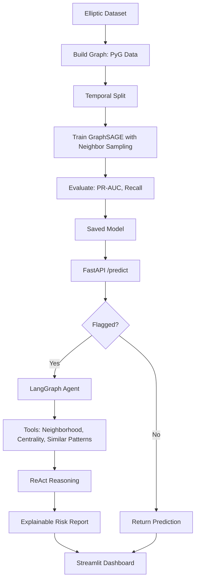

# AML Graph Detector

Anti-money laundering detection on Bitcoin transactions using a Graph Neural Network for classification and a LangGraph agentic layer for automated investigation and explainable risk reporting.

> Status: In progress (started May 2026)

## Problem

Money laundering hides illicit funds by dispersing them across many small transactions. The signal is rarely in a single transaction; it lives in the structure of the transaction network. An account that receives from dozens of sources and forwards to dozens of destinations in a short window is suspicious because of its position in the graph, not its individual amounts. Tabular models like XGBoost miss this because they treat each transaction independently.

This project models the problem as it actually is: a graph.

## Approach

The system has two layers.

A detection layer trains a GraphSAGE Graph Neural Network on the Elliptic dataset (around 204K real Bitcoin transactions, 166 features, labeled licit or illicit) to classify transactions using the structure of their neighborhood in the network.

An investigation layer activates when a transaction is flagged. A LangGraph agent investigates it using tools (neighborhood lookup, network centrality, similar pattern retrieval), reasons step by step using the ReAct pattern, and produces an explainable risk report.

## Architecture

## Key Design Decisions

- GraphSAGE over GCN or GAT, because 204K nodes do not fit full-batch in GPU memory and GraphSAGE supports neighbor sampling.
- Temporal split over random split, because a random split leaks future information into training, which is a common and serious mistake in fraud detection.
- PR-AUC over accuracy, because with roughly 2 percent positive class a model predicting everything as licit would score 98 percent accuracy while being useless.
- A baseline XGBoost model is trained first, to empirically demonstrate that the graph structure adds value over tabular features alone.
- The agent is used for investigation only. The GNN detects, the agent explains.

## Tech Stack

PyTorch Geometric, NetworkX, LangGraph, FastAPI, Pydantic, Streamlit, Plotly, Docker, GitHub Actions, deployed to Hugging Face Spaces.

## Status and Roadmap

- [x] Project setup and architecture
- [ ] Exploratory data analysis
- [ ] Baseline model (XGBoost)
- [ ] GraphSAGE training pipeline
- [ ] Evaluation and baseline comparison
- [ ] LangGraph investigation agent
- [ ] FastAPI service
- [ ] Streamlit dashboard
- [ ] Deployment to Hugging Face Spaces